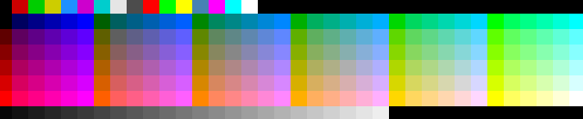

# Note-笔记

遍历``\033[48;5;$x   \033[0m``产生的颜色结果，依次从0-255



现在把上面这张图片用 ``image/png``包解析图片，把图片的rgb值和0-255对应起来。由于是截图，求解会有误差。

golang中读取出来的RGB单值需要除以0x101, 这个我得研究研究

```go
func IsExist(m *map[uint32]int, key uint32) bool {
	_, ok := (*m)[key]

	return ok
}

//计算rgb的组合值
func Caculate(r, g, b uint32) uint32 {
	var rgb uint32 = 0
	rgb += r << 16
	rgb += g << 8
	rgb += b

	return rgb
}

//解开rgb的组合值
func Unpack(rgb uint32) (r, g, b uint32) {
	v := rgb
	r = (v & 0xff0000) >> 16
	g = (v & 0xff00) >> 8
	b = (v & 0xff)

	return
}

func main() {
	f, err := os.Open(os.Args[1])

	if err != nil {
		fmt.Println(err.Error())
		return
	}

	p, err := png.Decode(f)
	if err != nil {
		fmt.Println(err.Error())
		return
	}
	r := p.Bounds()

	rgb := make(map[uint32]int)
	index := 0
	for i := 0; i < r.Max.Y; i++ {
		for j := 0; j < r.Max.X; j++ {
			r, g, b, _ := p.At(j, i).RGBA()
			r /= 0x101
			g /= 0x101
			b /= 0x101
			rgbv := Caculate(r, g, b)
			if !IsExist(&rgb, rgbv) {
				rgb[rgbv] = index
				index++
			}
		}
	}
	strs := make([]string, 256)

	for k, _ := range rgb {
		r, g, b := Unpack(k)
		//fmt.Printf("%d : %d,\n", k, rgb[k])
		strs[rgb[k]] = fmt.Sprintf("(%d %d %d)", r, g, b)
	}

	for i, _ := range strs {
		fmt.Println(i, strs[i])
	}
}
```

得到以下的表

```
{
0 (0 0 0)
1 (205 0 0)
2 (0 205 0)
3 (205 205 0)
4 (30 144 255)
5 (205 0 205)
6 (0 205 205)
7 (229 229 229)
8 (76 76 76)
9 (255 0 0)
10 (0 255 0)
11 (255 255 0)
12 (70 130 180)
13 (255 0 255)
14 (0 255 255)
15 (255 255 255)
16 (0 0 95)
17 (0 0 135)
18 (0 0 175)
19 (0 0 215)
20 (0 0 255)
21 (0 95 0)
22 (0 95 95)
23 (0 95 135)
24 (0 95 175)
25 (0 95 215)
26 (0 95 255)
27 (0 135 0)
28 (0 135 95)
29 (0 135 135)
30 (0 135 175)
31 (0 135 215)
32 (0 135 255)
33 (0 175 0)
34 (0 175 95)
35 (0 175 135)
36 (0 175 175)
37 (0 175 215)
38 (0 175 255)
39 (0 215 0)
40 (0 215 95)
41 (0 215 135)
42 (0 215 175)
43 (0 215 215)
44 (0 215 255)
45 (0 255 95)
46 (0 255 135)
47 (0 255 175)
48 (0 255 215)
49 (95 0 0)
50 (95 0 95)
51 (95 0 135)
52 (95 0 175)
53 (95 0 215)
54 (95 0 255)
55 (95 95 0)
56 (95 95 95)
57 (95 95 135)
58 (95 95 175)
59 (95 95 215)
60 (95 95 255)
61 (95 135 0)
62 (95 135 95)
63 (95 135 135)
64 (95 135 175)
65 (95 135 215)
66 (95 135 255)
67 (95 175 0)
68 (95 175 95)
69 (95 175 135)
70 (95 175 175)
71 (95 175 215)
72 (95 175 255)
73 (95 215 0)
74 (95 215 95)
75 (95 215 135)
76 (95 215 175)
77 (95 215 215)
78 (95 215 255)
79 (95 255 0)
80 (95 255 95)
81 (95 255 135)
82 (95 255 175)
83 (95 255 215)
84 (95 255 255)
85 (135 0 0)
86 (135 0 95)
87 (135 0 135)
88 (135 0 175)
89 (135 0 215)
90 (135 0 255)
91 (135 95 0)
92 (135 95 95)
93 (135 95 135)
94 (135 95 175)
95 (135 95 215)
96 (135 95 255)
97 (135 135 0)
98 (135 135 95)
99 (135 135 135)
100 (135 135 175)
101 (135 135 215)
102 (135 135 255)
103 (135 175 0)
104 (135 175 95)
105 (135 175 135)
106 (135 175 175)
107 (135 175 215)
108 (135 175 255)
109 (135 215 0)
110 (135 215 95)
111 (135 215 135)
112 (135 215 175)
113 (135 215 215)
114 (135 215 255)
115 (135 255 0)
116 (135 255 95)
117 (135 255 135)
118 (135 255 175)
119 (135 255 215)
120 (135 255 255)
121 (175 0 0)
122 (175 0 95)
123 (175 0 135)
124 (175 0 175)
125 (175 0 215)
126 (175 0 255)
127 (175 95 0)
128 (175 95 95)
129 (175 95 135)
130 (175 95 175)
131 (175 95 215)
132 (175 95 255)
133 (175 135 0)
134 (175 135 95)
135 (175 135 135)
136 (175 135 175)
137 (175 135 215)
138 (175 135 255)
139 (175 175 0)
140 (175 175 95)
141 (175 175 135)
142 (175 175 175)
143 (175 175 215)
144 (175 175 255)
145 (175 215 0)
146 (175 215 95)
147 (175 215 135)
148 (175 215 175)
149 (175 215 215)
150 (175 215 255)
151 (175 255 0)
152 (175 255 95)
153 (175 255 135)
154 (175 255 175)
155 (175 255 215)
156 (175 255 255)
157 (215 0 0)
158 (215 0 95)
159 (215 0 135)
160 (215 0 175)
161 (215 0 215)
162 (215 0 255)
163 (215 95 0)
164 (215 95 95)
165 (215 95 135)
166 (215 95 175)
167 (215 95 215)
168 (215 95 255)
169 (215 135 0)
170 (215 135 95)
171 (215 135 135)
172 (215 135 175)
173 (215 135 215)
174 (215 135 255)
175 (215 175 0)
176 (215 175 95)
177 (215 175 135)
178 (215 175 175)
179 (215 175 215)
180 (215 175 255)
181 (215 215 0)
182 (215 215 95)
183 (215 215 135)
184 (215 215 175)
185 (215 215 215)
186 (215 215 255)
187 (215 255 0)
188 (215 255 95)
189 (215 255 135)
190 (215 255 175)
191 (215 255 215)
192 (215 255 255)
193 (255 0 95)
194 (255 0 135)
195 (255 0 175)
196 (255 0 215)
197 (255 95 0)
198 (255 95 95)
199 (255 95 135)
200 (255 95 175)
201 (255 95 215)
202 (255 95 255)
203 (255 135 0)
204 (255 135 95)
205 (255 135 135)
206 (255 135 175)
207 (255 135 215)
208 (255 135 255)
209 (255 175 0)
210 (255 175 95)
211 (255 175 135)
212 (255 175 175)
213 (255 175 215)
214 (255 175 255)
215 (255 215 0)
216 (255 215 95)
217 (255 215 135)
218 (255 215 175)
219 (255 215 215)
220 (255 215 255)
221 (255 255 95)
222 (255 255 135)
223 (255 255 175)
224 (255 255 215)
225 (8 8 8)
226 (18 18 18)
227 (28 28 28)
228 (38 38 38)
229 (48 48 48)
230 (58 58 58)
231 (68 68 68)
232 (78 78 78)
233 (88 88 88)
234 (98 98 98)
235 (108 108 108)
236 (118 118 118)
237 (128 128 128)
238 (138 138 138)
239 (148 148 148)
240 (158 158 158)
241 (168 168 168)
242 (178 178 178)
243 (188 188 188)
244 (198 198 198)
245 (208 208 208)
246 (218 218 218)
247 (228 228 228)
248 (238 238 238)
249 
250 
251 
252 
253 
254 
255 

}
```